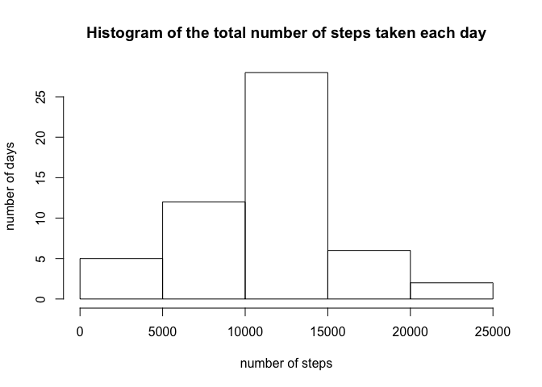
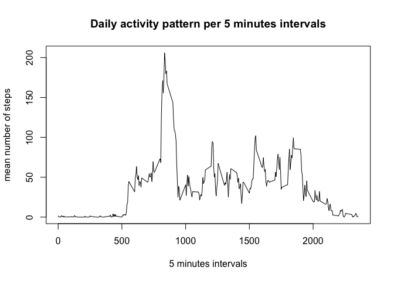
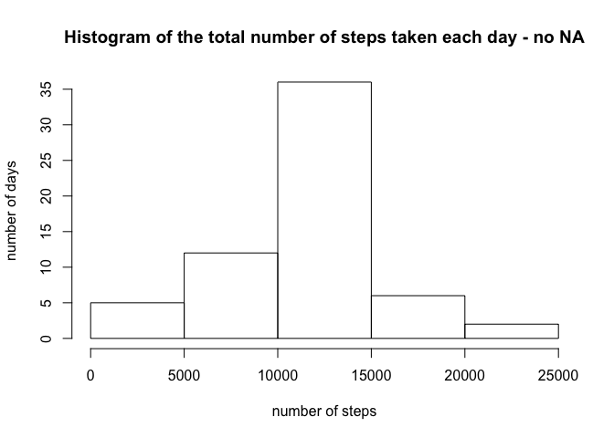
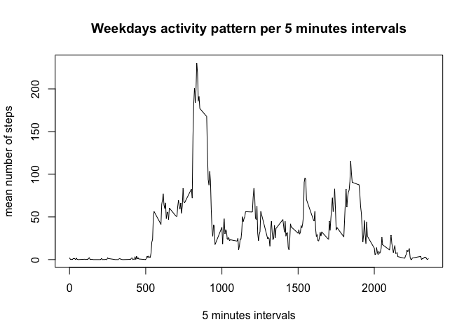
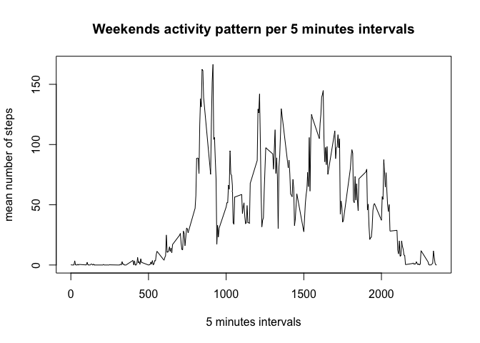

# Reproducible Research: Peer Assessment 1
Michele Guerriero  
26 giugno 2016  


## Loading and preprocessing the data

The following piece of code just load the input datasera from the activity.csv file, assuming that it has been previously extracted from the source .zip file.


```r
data <- read.csv(file = "activity.csv")
```

## What is mean total number of steps taken per day?

In order to understand more about the distirbution of the number of steps taken per day and to find the mean total number of steps per day, it is necessary to do the following:

- summing the number of steps reported by each observation in the input dataset which refers to the same day
- building an histogram from the aggregated dataset to understand more about the distribution
- calculating the mean and the median of the total number of steps taken per daya from the aggregated datset

The following code does what we need and it is shown the requested histogram, mean and median.


```r
steps_per_day <- aggregate(data$steps, by=list(dates=data$date), FUN=sum)
hist(x = steps_per_day$x, main = "Histogram of the total number of steps taken each day", xlab = "number of steps", ylab = "number of days" )
```

<!-- -->

```r
mean(steps_per_day$x, na.rm=TRUE)
```

```
## [1] 10766.19
```

```r
median(steps_per_day$x, na.rm=TRUE)
```

```
## [1] 10765
```

## What is the average daily activity pattern?

In order to understand more about the daily activity pattern, on a 5 minutes interval base, we need to:

- averaging the number of steps reported by each observation in the input dataset which refers to the same interval in different days
- building a plot which shows the mean number of steps taken per 5 minutes intervbal
- find the 5 minutes interval which shows the maximum average number of steps taken

The following code does what we need and the obtained plot along with the maximum found are reported.


```r
mean_steps_per_interval <- aggregate(data$steps, by=list(intervals=data$interval), FUN=mean, na.rm = TRUE)
plot(mean_steps_per_interval, type = "l", main = "Daily activity pattern per 5 minutes intervals", xlab = "5 minutes intervals", ylab = "mean number of steps" )
```

<!-- -->

```r
mean_steps_per_interval[ mean_steps_per_interval$x == max( mean_steps_per_interval$x ) , ]
```

```
##     intervals        x
## 104       835 206.1698
```

## Imputing missing values

It is quite easy to fine the number of missing values for the **steps** column in the input dataser:


```r
sum(is.na(data$steps))
```

```
## [1] 2304
```

We decided to built the new dataset, cleaned from missing values, by replacing each missing value with the mean number of steps found in the previous point for the associated interval (for each observation in the input dataset with a missng value in the **steps** column).


```r
data_no_missing <- data
data_no_missing$steps <- ifelse(is.na(data_no_missing$steps) == TRUE, mean_steps_per_interval$x[mean_steps_per_interval$intervals %in% data_no_missing$interval], data_no_missing$steps)
```

Finally we plot again the histogram showing the distribution of the number of steps taken per day, this time using the cleaned dataset.


```r
steps_per_day_no_missing <- aggregate(data_no_missing$steps, by=list(dates=data_no_missing$date), FUN=sum)
hist(x = steps_per_day_no_missing$x, main = "Histogram of the total number of steps taken each day - no NA", xlab = "number of steps", ylab = "number of days" )
```

<!-- -->

We can notice that the removal of missing values makes the histogram to change and to becamo more accurate.

## Are there differences in activity patterns between weekdays and weekends?

Finally in order to understand if there are differences in activity patterns between the weekdays and the weekends, we just repeat the analysis performed at step 2, but this time first add a new column which classifies each observation in the *cleaned* dataset as **weekday** or **weekend**, but looking at the **date** column; then we split the dataset into two, based on the level of the new columdn (*weekday*, *weekend*). The two obtained plots showing the requested difference are reported.


```r
steps_per_day <- aggregate(data$steps, by=list(dates=data$date), FUN=sum)
data_no_missing$date <- as.Date(data_no_missing$date)
data_no_missing$wend <- as.factor(ifelse(weekdays(data_no_missing$date) %in% c("Saturday","Sunday"), "Weekend", "Weekday")) 
splits<- split(data_no_missing, data_no_missing$wend)
weekdays <- as.data.frame(splits[1])
weekends <- as.data.frame(splits[2])
mean_steps_per_interval_weekdays <- aggregate(weekdays$Weekday.steps, by=list(intervals=weekdays$Weekday.interval), FUN=mean, na.rm = TRUE)
mean_steps_per_interval_weekends <- aggregate(weekends$Weekend.steps, by=list(intervals=weekends$Weekend.interval), FUN=mean, na.rm = TRUE)
```

The two obtained plots showing the requested difference are reported.


```r
plot(mean_steps_per_interval_weekdays, type = "l", main = "Weekdays activity pattern per 5 minutes intervals", xlab = "5 minutes intervals", ylab = "mean number of steps" )
```

<!-- -->

```r
plot(mean_steps_per_interval_weekends, type = "l", main = "Weekends activity pattern per 5 minutes intervals", xlab = "5 minutes intervals", ylab = "mean number of steps" )
```

<!-- -->
